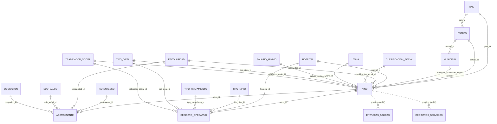

# Casa Ronald — Legacy System Documentation (prototype audit)

> **NOTE (2026-09-03)**: This document describes the ORIGINAL 2021 prototype, preserved
> at git tag `legacy-final`. The `fase-0-endurecimiento` branch is a full Laravel 12
> rewrite that fixes the defects catalogued in §8 (auth, validation, schema, QR, grids,
> scanner). See `README.md` for the current system. This file is kept as the audit
> record that drove the rewrite.

> Reverse-engineered documentation, generated 2026-09-03. The repository shipped with no
> documentation (the README was the stock Laravel boilerplate); everything below was
> reconstructed from the code, migrations, seeders, git history, and a verified local run.

## 1. What this system is

A guest and services management system for **Fundación Infantil Ronald McDonald México**
("Casa Ronald", Puebla) — a home that hosts children undergoing medical treatment together
with their families. Built December 2020 – January 2021 on Laravel 8.

Core workflow:

1. **Intake** — a social worker registers a child (*niño*) with full demographic,
   socioeconomic, and medical data, and their companions (*acompañantes*, usually parents).
2. **QR credential** — the system assigns each child a 6-character QR code (3 digits +
   3 letters, e.g. `A1B2C3`) and renders a printable ID card (*ficha*/*carnet*) with the
   child's data, companions, hospital, and the QR image.
3. **Service logging** — staff scan the card to log usage of house services: **lavandería**
   (laundry), **comedor** (dining hall), **escuela** (school), **transporte** (transport),
   and **entradas/salidas** (check-in/check-out). The scanner client is *not* in this repo —
   it hits the JSON endpoints described in §6.
4. **Reporting** — per-service DataTables grids show the logged records.

An **Operación** module (operational stay records: room, admission/discharge, diagnosis)
was started but never finished — its dashboard is a stub and its sidebar link is
commented out.

## 2. Tech stack

| Layer | Technology |
|---|---|
| Framework | Laravel 8.12 (PHP ^7.3 \| ^8.0), January 2021 lock file |
| Database | MySQL, database name `casaronald` |
| Server-side packages | `intervention/image` (ficha rendering), `yajra/laravel-datatables-oracle` (grids), `laravel/ui`, `guzzlehttp/guzzle`, `fruitcake/laravel-cors`, `fideloper/proxy` |
| Frontend | Server-rendered Blade + jQuery + Bootstrap + DataTables + toastr + Font Awesome + SlidesJS, all loaded from CDN/`public/` (the Laravel Mix pipeline exists but is unused) |
| QR generation | Server-side: originally Google Charts Infographics API (**dead — see §8**), composited with Intervention Image |
| Auth | **None.** Every route is public. `users` table migration was deleted; no login route exists |

## 3. Running locally (verified 2026-09-03 on macOS)

```bash
# 1. PHP 8.0 (modern PHP breaks this Laravel 8 vendor tree)
brew tap shivammathur/php
brew install shivammathur/php/php@8.0
PHP=/opt/homebrew/opt/php@8.0/bin/php

# 2. Composer (any recent composer works with PHP 8.0)
curl -sS https://getcomposer.org/installer | $PHP -- --install-dir=. --filename=composer.phar
$PHP composer.phar install

# 3. MySQL — create the database (.env expects root with empty password on 127.0.0.1)
mysql -u root -e "CREATE DATABASE IF NOT EXISTS casaronald CHARACTER SET utf8mb4 COLLATE utf8mb4_unicode_ci;"

# 4. Point APP_URL at localhost (the committed .env pointed at a dead production host)
#    APP_URL=http://127.0.0.1:8000

# 5. Migrate + seed (creates 22 tables, 293 rows incl. 4 demo children "Ronald Mc Uno..Cuatro")
$PHP artisan migrate:fresh --seed

# 6. Storage symlink (needed for the generated ID cards to be web-visible)
$PHP artisan storage:link

# 7. Serve
$PHP artisan serve   # → http://127.0.0.1:8000
```

Demo data to play with: child id `1` = "Ronald Mc Uno", QR `A1B2C3`.

- Web UI: `/` (home), `/familias` (children register + intake forms), `/registros`
  (service grids menu).
- Generate an ID card: `GET /get-ficha/1` → returns the URL of the rendered JPG.
- Simulate a scanner: `GET /get-nino-by-qr?qr=A1B2C3`,
  `GET /add-registro-servicio?qr=A1B2C3&servicio=lavanderia`,
  `GET /add-entrada-salida?qr=A1B2C3&tipo_registro=entrada`.

Two fixes were required to run in 2026 (applied in the working tree, see §9):
the Google Charts QR API is dead and was swapped for `api.qrserver.com`, and the
ficha URL was un-hardcoded from the old production domain.

## 4. Architecture overview

Classic server-rendered Laravel MVC, with two idioms worth knowing before touching it:

- **Fat models, thin controllers**: insert logic lives in static `store()` /
  `store2()` methods on the models (`Nino::store()`, `Acompanante::store()`,
  `EntradasSalidas::store()`, …). `store()` maps abbreviated web-form field names
  (`app`, `apm`, `fec_sol`, `hos`, …) to columns; `store2()` is a raw bulk-import
  variant that accepts explicit primary keys.
- **Legacy namespace**: the 20 domain models live in `App\` (Laravel 6 style,
  e.g. `app/Nino.php`), while only `User` lives in `App\Models\`. Relationships are
  declared with string class names (`'App\Estado'`), which hid several typo bugs (§8).

```
routes/web.php ──► HomeController        (9 view-dispatch routes)
               ──► ApiNinoController     (child CRUD + DataTable JSON)
               ──► ApiAcompananteController (companion CRUD + DataTable JSON)
               ──► ApiRegistrosController   (service/entry-exit logging + 5 grids)
               ──► ApiRegistroOperativoController (broken, see §8)
               ──► QrController          (ficha/ID-card image compositor)
               ──► AuxiliaresController  (empty stub; /get-qr route is dead)

resources/views/
  layouts/skeleton.blade.php   single layout (loads all CSS/JS)
  parts/sidebar.blade.php      fixed left nav
  dashboards/{inicio,registros,operacion}
  datatables/{ninos,acompanantes,lavanderia,comedor,escuela,transporte,entradas_salidas}
  forms/{nino,acompanante,ficha,operativo}   Bootstrap modals (operativo is orphaned)
```

## 5. Data model

22 tables. All PKs are `BIGINT UNSIGNED AUTO_INCREMENT id`; all text columns are
`VARCHAR(255)`; all FKs are `RESTRICT` (no cascade); every table has timestamps.

### Core entities

- **`nino`** (39 cols) — the child. Identity, address, contact, medical notes
  (`diagnostico`, `medico`, allergies), stay status/dates, plus 10 FKs into the catalogs
  (hospital, escolaridad, clasificación social, zona, salario mínimo, tipo de dieta,
  trabajador social, país, estado, municipio). Carries the `qr` code
  (**not unique, not indexed** — see §8).
- **`acompanante`** (25 cols) — companion, `nino_id` FK plus parentesco/escolaridad/
  edo_salud/ocupacion FKs and a socioeconomic block (works, insurance, own home,
  financial aid, rent, dependents, monthly income — booleans and money stored as INT).
- **`registro_operativo`** (17 cols) — the unfinished stay record: `nino_id`, 5 catalog
  FKs, admission/discharge dates (discharge is NOT NULL — an open stay can't be stored),
  doctor, diagnosis, room number (plain INT). **No working write path exists** (§8).
- **`entradas_salidas`** — check-in/out log keyed on the raw `qr` string
  (no FK). `entrada`/`salida` are DATE columns although code writes `now()`, so the
  time of day is silently truncated.
- **`registros_servicios`** — service usage log: `qr` string + free-text `servicio`
  (`lavanderia` | `comedor` | `transporte` | `escuela` by convention only).
- **`habitaciones`** — empty stub table (id + timestamps only), no model, never used.

### Catalogs (id + one value column)

`pais`, `escolaridad`, `clasificacion_social`, `zona`, `salario_minimo`, `parentesco`,
`edo_salud`, `ocupacion`, `hospital`, `tipo_ninio`, `tipo_tratamiento`, `tipo_dieta`,
`trabajador_social`, plus `tratamiento` (value column named `nombre`, breaking the
convention; overlaps `tipo_tratamiento` and is written by nothing) and the geography
chain `pais 1—N estado 1—N municipio`.

### ER diagram



### Seed data (`database/seeders/DatabaseSeeder.php`, 19 classes in one file)

293 rows total: 3 países, 32 estados (all under México), 81 municipios (**all Guerrero**),
7 clasificaciones, 3 estados de salud, 11 escolaridades, 17 hospitales (CRIT, HNP, IMSS…),
10 ocupaciones, 14 parentescos, 5 salarios mínimos (two are the placeholder
`'NO SPEC EN EXCEL'`), 7 dietas, 2 tipos de niño, 14 tipos de tratamiento,
**66 trabajadores sociales — real personal names hard-coded in the repo (PII)**, 3 zonas,
16 tratamientos, plus demo data: 4 children ("Ronald Mc Uno..Cuatro", QRs `A1B2C3`,
`J1B2X7`, `B1S2C3`, `A9B215`), 4 companions, 2 registros operativos
("Dr. Ronald McDonald"). The demo children carry Puebla municipality names as free text
while their `estado_id` points at Guerrero — the seed mirrors the schema's
municipio string/FK duality (§8).

## 6. Routes & API reference

All routes are in `routes/web.php` (the `api.php` file is stock/dead). **No auth on
anything.** Names in parentheses are route names.

### Pages (HomeController → Blade)

| Path | View | Notes |
|---|---|---|
| `/` | `welcome` → `dashboards/inicio` | Landing: carousel + module cards |
| `/familias` | `familias` | Main screen: children grid, intake modals, ficha modal. Loads 12 catalogs via `::all()` |
| `/registros` | `registros` → `dashboards/registros` | Menu of the 5 service grids |
| `/operaciones` | `operaciones` → `dashboards/operacion` | Stub ("Operación" heading only) |
| `/registros-lavanderia` `/registros-comedor` `/registros-escuela` `/registros-transporte` `/registros-entradas-salidas` | `datatables/*` | Per-service record grids |

### JSON / data endpoints

| Method | Path | Action | Notes |
|---|---|---|---|
| GET | `/get-nino/{id}` | Raw child JSON with `pais`,`estado` | Exposes all fields incl. medical |
| GET | `/get-nino-by-qr?qr=` | Scanner lookup: name, location, sex, age, companions | Returns `{}` (not 404) when unknown |
| GET | `/get-ninos-datatable` | Yajra DataTable feed for the children grid | AJAX-only; loads whole table each draw |
| POST | `/add-nino` | Intake form insert via `Nino::store()` | Validation commented out |
| GET/POST | `/add-nino-script` | Bulk insert via `Nino::store2()` | Broken: omits NOT NULL FKs; registered twice |
| GET | `/get-acompanantes-datatable?id=` | Companions of one child | |
| POST | `/add-acompanante` | Companion form insert | Validation commented out |
| GET | `/add-acompanante-script` | Bulk insert | Broken: omits `fecha_registro` |
| GET | `/add-registro-script` | Registro operativo insert | **Always fatals** (§8) |
| GET | `/add-registro-servicio?qr=&servicio=` | Log a service usage | Only endpoint with active validation |
| GET | `/add-entrada-salida?qr=&tipo_registro=entrada\|salida` | Open/close a check-in | Null-deref on salida with no history |
| GET | `/get-{lavanderia,comedor,transporte,escuela}-datatable` | Service grids | |
| GET | `/get-entradas-salidas-datatable` | Entry/exit grid | **Broken** (missing `->get()`, date formatting) |
| GET | `/get-ficha/{id?}` | Generate + return ID-card JPG URL | Defaults to id **2**; no null guard |
| GET | `/get-qr` | — | **Dead route**: `AuxiliaresController` is empty |

Response envelope for writes: `{status: '1'|'0', title, msg, data}` with HTTP 201/200.
Note that several *state-changing* endpoints are GET (no CSRF protection applies).

## 7. The QR flow, end to end

1. **Code generation** — `Nino::generaQR()` draws from `0-9A-Z` until it has exactly
   3 digits + 3 letters (interleaved), e.g. `A1B2C3`. Uses `mt_rand()` (predictable).
2. **Uniqueness — not enforced.** `Nino::validaQR()` is a stub that returns `1`
   unconditionally, so the collision-check loop in `store()` never runs, and `nino.qr`
   has no unique index. A collision would merge two children's service histories,
   because the log tables key on the QR *string*, not `nino_id`.
3. **Card rendering** — `QrController@ficha` fetches a 300×300 QR PNG over HTTP
   (originally Google Charts; now `api.qrserver.com` — see §9), writes it to the
   *shared* temp file `storage/app/public/qr/qr.png` (race condition under concurrency),
   then Intervention Image composites a 1072×830 card: two template PNGs, the RMHC logo,
   location/hospital pictograms, and typeset text in Raleway Bold (child name/age,
   locality, municipio/estado/país, hospital, and the companion list). Saved as
   `storage/app/public/carnes/{id}.jpg`.
4. **Display/print** — the "Ver QR" button in the children grid calls `/get-ficha/{id}`
   and shows `storage/carnes/{id}.jpg` in a modal (with a race: the `src` is set before
   generation finishes, so first view can show a broken image). The "Descargar" button
   has no handler.
5. **Scanning** — the QR encodes `http://casaronald.denissereginagarcia.com/familias/{qr}`,
   **a route that does not exist** (only `/familias` with no parameter). The real
   scanner contract is the JSON endpoints (`/get-nino-by-qr`, `/add-registro-servicio`,
   `/add-entrada-salida`), consumed by an external client that is not in this repo.
6. **Reporting** — the five `/registros-*` grids read the log tables back, showing the
   raw QR code (never the child's name — no join to `nino` is performed).

## 8. Known issues

The dominant finding first: **there is no authentication or authorization anywhere**,
on a system holding minors' medical, address, and socioeconomic data, with
state-changing GET endpoints and `APP_DEBUG=true` committed in `.env`. The hardcoded
asset URLs (`…/storage/app/public/…`, sidebar link to `…/public/`) indicate the
production deployment served the *project root*, exposing `.env` and logs. Treat any
redeployment as a from-scratch security exercise.

### Fatal at runtime

1. `GET /get-qr` → `AuxiliaresController@getQr` does not exist (class is an empty stub).
2. `GET /add-registro-script` can never succeed: the controller doesn't import the model,
   and `RegistroOperativo::store2()` instantiates `new Registro()` — a class that doesn't
   exist (`app/RegistroOperativo.php:12`). `registro_operativo` is unwritable by any path.
3. The entradas/salidas grid endpoint iterates a Query Builder
   (`EntradasSalidas::select('*')` missing `->get()`) and calls `->format()` on string
   dates (`ApiRegistrosController`), so `/registros-entradas-salidas` shows an eternal
   "processing" state.
4. `EntradasSalidas::store()` null-derefs on a "salida" for a QR with no prior entry.
5. `Estado::municipios()` → `hasMany('App\Municipios')` — class doesn't exist (typo).
6. `Municipio::estado()` → `belongsTo('App\estado')` — lowercase: works on macOS,
   **breaks on Linux** (case-sensitive autoload).
7. Latent (unrouted): `HomeController@inicio` returns a non-existent view;
   `ApiNinoController@update/@select2` call model methods that don't exist.

### Data correctness

8. **Surnames swapped on child intake**: `Nino::store()` maps form field `app` →
   `apellido_materno` and `apm` → `apellido_paterno` (the companion path maps the same
   fields the opposite way). Every child registered via the form has paternal/maternal
   surnames transposed.
9. **Admission/discharge dates never saved**: form posts `fec_ing`/`fec_sal`, model
   reads `fec_in`/`fec_eg`.
10. **Sex always "Indefinido"** in `/get-nino-by-qr`: the API compares against `'M'`/`'F'`
    but the form stores `"Masculino"`/`"Femenino"`.
11. **QR uniqueness unenforced** (see §7.2).
12. Silently discarded form fields: food/medicine allergies, the 16 treatment checkboxes
    (all share `name="tt"` without `[]`), companion observations, and both photo uploads
    (`$(form).serialize()` cannot carry files; no controller accepts one).
13. `municipio` exists as both a free-text column and a `belongsTo` relation on `Nino`;
    only the string is ever written, so `$nino->municipio` returns a string in PHP but
    the (null) relation in JSON. The uncommitted diff works around this by dropping
    `municipio` from eager-loads.
14. Validation blocks are commented out in 5 of 6 store methods.
15. `entrada`/`salida` are DATE columns receiving `now()` — the time of day is lost, on
    a check-in/out feature. Grids also format dates as US `m/d/Y h:i:s` from UTC
    timestamps (timezone was never set to America/Mexico_City).
16. AJAX submit handlers show a success toast unconditionally — failures (`status: '0'`
    or 500s) are invisible to the user.
17. The Parentesco dropdown renders blank labels
    (`forms/acompanante.blade.php:69` uses `$n->parentesco` from a leaked loop variable
    instead of `$p->parentesco`).

### Design / hygiene (summary)

- No `$fillable` on any domain model (seeding works only because Laravel unguards
  during `db:seed`); no `$casts` (booleans as ints, dates as strings); 11 FKs without
  Eloquent relations; `RegistroOperativo` has none of its 6.
- The layout loads **three jQuery copies (1.9.1 last, clobbering 3.5.1), Bootstrap 3
  and 4 CSS+JS simultaneously, and two Font Awesome majors** — the likely cause of any
  modal/grid flakiness.
- Duplicate DOM ids across the two modals rendered into `/familias` break selectors and
  label associations.
- Dead weight: `habitaciones` table (no columns/model/usage), `tratamiento` table
  (written by nothing), orphaned `forms/operativo.blade.php` (posts to the wrong route),
  empty `views/mods/` dir, unused Mix pipeline, `alert('aAAAa')` debug leftovers in the
  photo-preview code, school-report images and ~35 icons from an unrelated Gomoku
  project in `public/`.
- Production hostname `casaronald.denissereginagarcia.com` hardcoded in ≥6 places
  (config fallback, QR payload, sidebar links/JS, ficha placeholder, avatar URL);
  the sidebar collapse only works on that host.
- **PII in the repo**: 66 real social workers' names in the seeder; a live `APP_KEY`
  and debug mode in the committed `.env`.
- No `users`/`password_resets`/`failed_jobs` migrations (deleted from the scaffold),
  while `User` model, `UserFactory`, and `config/auth.php` still expect them.
- No tests beyond the stock scaffold. Deleting catalog rows in use raises raw SQL
  errors (all FKs are RESTRICT with no app-level handling).

## 9. Repository state & local changes

**Git history** (10 commits, Dec 2020 → Jan 2021): scaffold + catalog migrations →
core tables and seeds → children DataTable → views/routes → QR generation algorithm →
QR ficha ("works, with some bugs") → two catch-all commits, the last one titled
*"Todo junto por flojera de separar los commits"*.

**Uncommitted changes found in the working tree** (pre-existing, kept as found):
`ApiNinoController` drops `municipio` from eager-loads; `routes/web.php` fixes the
`add-registro-script` controller name; dashboard cards wired to real routes; laundry
grid icon button; slider colors switched to brand yellow `#ffc72c`; "Operación"
sidebar link commented out.

**Changes applied during this analysis (2026-09-03)** to make the system run:

- `app/Http/Controllers/QrController.php` — the QR image source
  `chart.googleapis.com` (shut down by Google) was replaced with the equivalent
  `api.qrserver.com/v1/create-qr-code/`, and the returned card URL now uses `asset()`
  instead of the hardcoded dead domain. A local QR library
  (e.g. `endroid/qr-code`) would be the proper long-term fix.
- `.env` — `APP_URL` set to `http://127.0.0.1:8000`.
- `php artisan storage:link` was run (creates `public/storage`, untracked).
